# Handson Application - 機能概要

## アプリケーション概要

画像とメモを組み合わせて保存・管理できるWebアプリケーション。Spring Boot 3.5.7をベースに、セキュアでスケーラブルなアーキテクチャで構築されています。

---

## システムアーキテクチャ

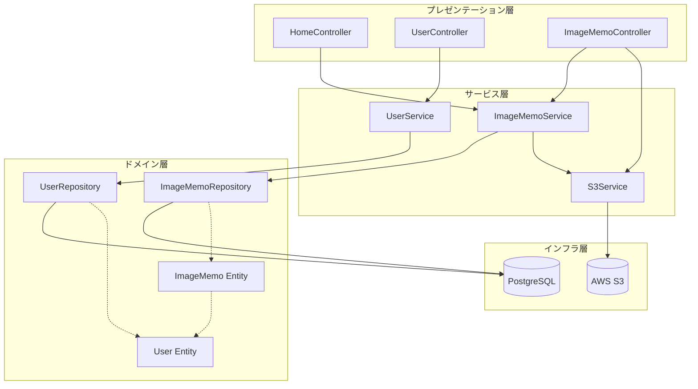

---

## 主要機能

### 1. ユーザー管理機能

#### ユーザー登録フロー

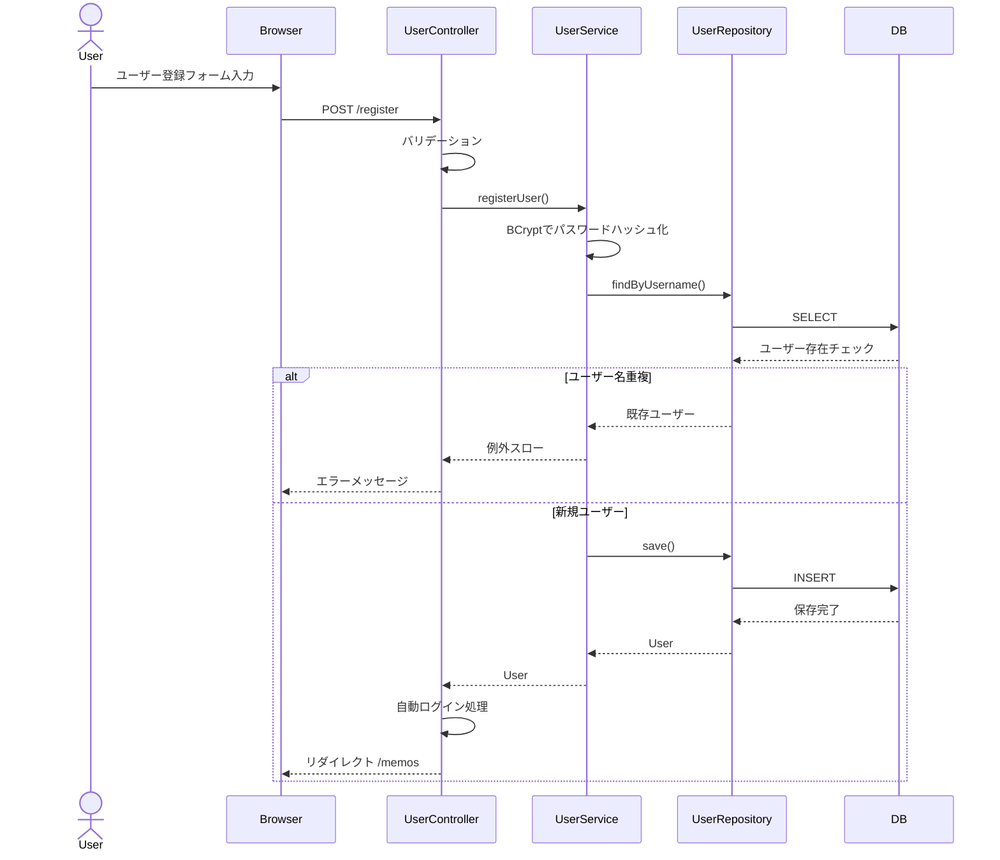

#### 1.1 ユーザー登録
- **エンドポイント**: `POST /register`
- **機能説明**:
  - 新規アカウント作成（ユーザー名とパスワード）
  - パスワード確認入力によるタイプミス防止
  - ユーザー名の重複チェック
  - BCryptによるパスワードハッシュ化
  - 登録後の自動リダイレクト

#### 1.2 ログイン/ログアウト
- **エンドポイント**:
  - `GET /login` - ログインフォーム表示
  - `POST /login` - ログイン処理（Spring Security）
  - `POST /logout` - ログアウト処理
- **機能説明**:
  - フォームベース認証
  - セッション管理
  - ログイン成功時に画像メモ一覧へリダイレクト
  - わかりやすいエラーメッセージ表示

---

### 2. 画像メモ管理機能

#### 画像メモ作成フロー

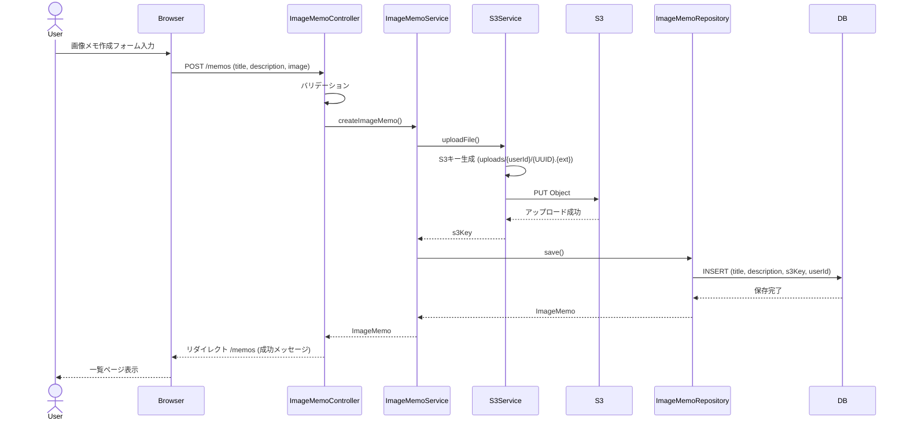

#### 画像メモ削除フロー

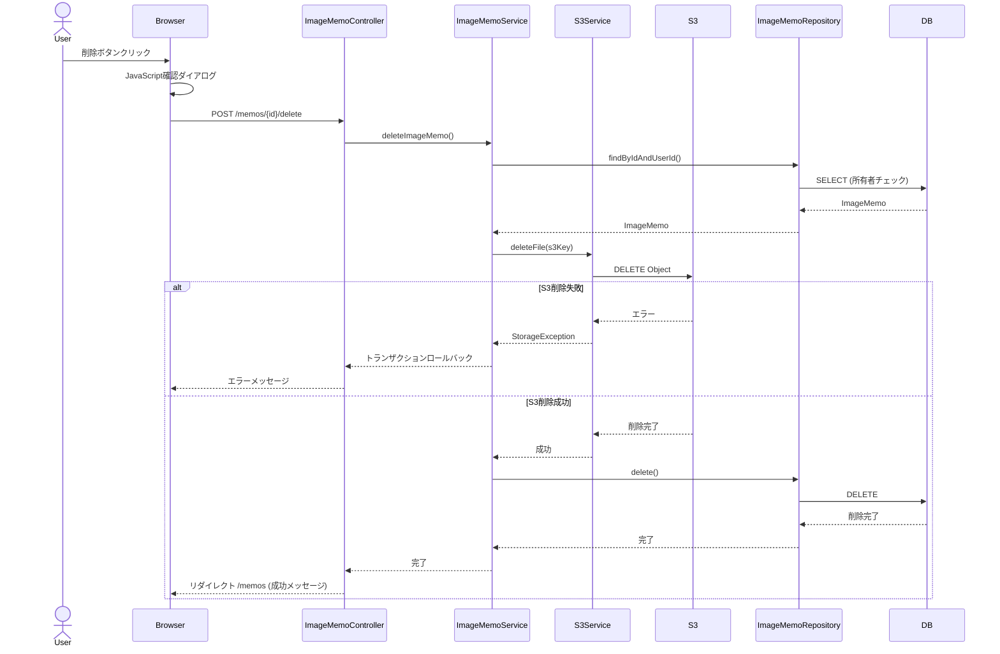

#### 画像配信フロー（アプリケーションProxyパターン）

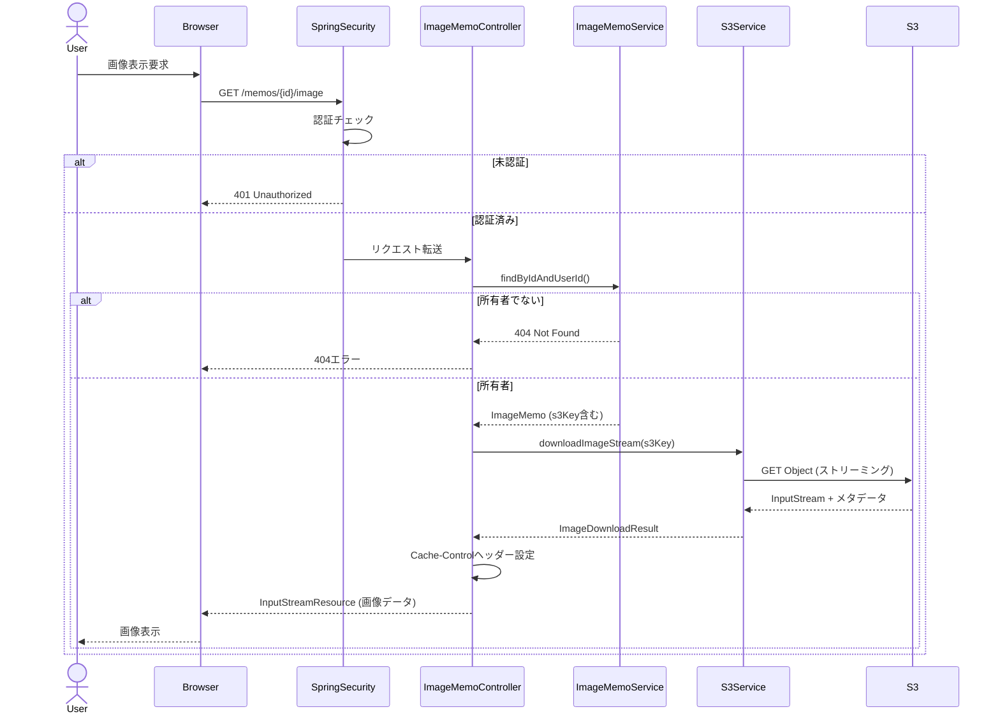

#### 2.1 画像メモ作成
- **エンドポイント**:
  - `GET /memos/new` - 作成フォーム表示
  - `POST /memos` - 新規作成処理
- **機能説明**:
  - タイトル入力（必須、最大255文字）
  - 説明入力（任意、TEXT型で無制限）
  - 画像ファイルアップロード（必須）
  - 対応形式: JPG, JPEG, PNG, GIF
  - 最大ファイルサイズ: 10MB
  - S3への自動アップロード
  - データベースへのメタデータ保存
- **S3キー形式**: `uploads/{userId}/{UUID}.{拡張子}`
  - ユーザーIDでパス分離
  - UUIDによる一意性保証
  - 拡張子保持でContent-Type自動判定

#### 2.2 画像メモ一覧表示
- **エンドポイント**: `GET /memos`
- **機能説明**:
  - ログインユーザーの全画像メモを表示
  - グリッドレイアウトによる見やすい表示
  - サムネイル画像プレビュー
  - タイトル、説明（100文字まで）、作成日時を表示
  - 作成日時の降順でソート（最新が上）
  - ページネーション対応（10件/ページ）
  - 各メモをクリックで詳細表示へ
- **パフォーマンス最適化**:
  - JOIN FETCHによるN+1クエリ対策
  - ページングでデータベース負荷を軽減

#### 2.3 画像メモ詳細表示
- **エンドポイント**: `GET /memos/{id}`
- **機能説明**:
  - フルサイズ画像表示
  - 完全なタイトルと説明文
  - 作成日時表示
  - アクションボタン（一覧に戻る、削除）
  - 所有者チェック（自分のメモのみ閲覧可能）

#### 2.4 画像メモ削除
- **エンドポイント**: `POST /memos/{id}/delete`
- **機能説明**:
  - JavaScriptによる確認ダイアログ表示
  - 所有者検証（自分のメモのみ削除可能）
  - S3から画像を削除
  - データベースからレコードを削除
  - トランザクション制御（S3削除失敗時はDB削除もロールバック）
  - 成功メッセージ表示後、一覧へリダイレクト

#### 2.5 セキュアな画像配信
- **エンドポイント**: `GET /memos/{id}/image`
- **機能説明**:
  - アプリケーションProxyパターンによる配信
  - 認証チェック（未ログインは401エラー）
  - 所有者チェック（他人の画像は404エラー）
  - S3からストリーミングダウンロード
  - InputStreamResourceによるメモリ効率的な配信
  - ブラウザキャッシュ対応（1時間、private）
  - Content-Type自動設定
- **セキュリティメリット**:
  - S3バケット名を外部に露出しない
  - S3をプライベート設定のまま利用可能
  - アプリケーション層できめ細かいアクセス制御

---

### 3. セキュリティ機能

#### 認証・認可フロー

```mermaid
graph LR
    A[ユーザー] -->|リクエスト| B{Spring Security}
    B -->|認証必要| C{ログイン済み?}
    C -->|No| D[/login へリダイレクト]
    C -->|Yes| E{CSRF Token検証}
    E -->|Invalid| F[403 Forbidden]
    E -->|Valid| G{所有者チェック}
    G -->|他人のリソース| H[404 Not Found]
    G -->|自分のリソース| I[処理実行]
    B -->|公開リソース| I
```

#### 3.1 認証機能
- **実装**: Spring Security
- **認証方式**: フォームベース認証
- **パスワード管理**:
  - BCryptアルゴリズムによるハッシュ化
  - ソルト付きハッシュで辞書攻撃対策
  - 平文保存なし

#### 3.2 アクセス制御

| パス | アクセス権限 | 備考 |
|------|------------|------|
| `/` | 全員 | トップページ |
| `/register` | 全員 | ユーザー登録 |
| `/login` | 全員 | ログインページ |
| `/css/**`, `/js/**`, `/images/**` | 全員 | 静的リソース |
| `/actuator/health` | 全員 | ヘルスチェック |
| 上記以外すべて | 認証済みユーザーのみ | ログイン必須 |

#### 3.3 認可機能
- **所有者ベースのアクセス制御**:
  - ユーザーは自分の画像メモのみ閲覧・削除可能
  - すべてのクエリで`userId`によるフィルタリング
  - 不正アクセス時は404を返却（情報漏洩防止）

#### 3.4 CSRF保護
- デフォルトで有効
- Thymeleafが自動的にトークン処理

---

### 4. データ管理機能

#### データモデル（ER図）

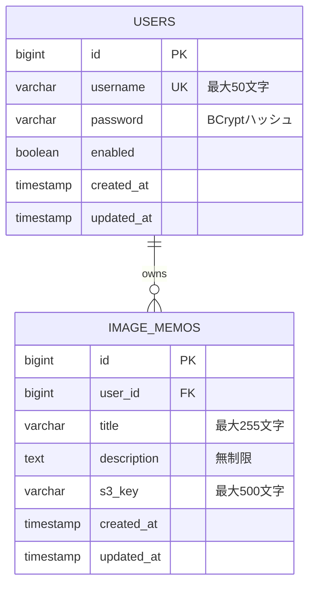

#### クエリ最適化戦略

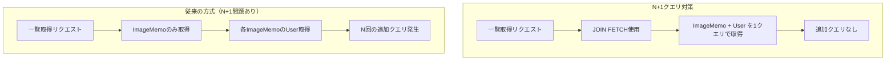

#### 4.1 データベース構成
- **RDBMS**: PostgreSQL 17
- **ORM**: Spring Data JPA / Hibernate
- **マイグレーション**: Flyway

**エンティティ構造**:

**Userエンティティ**:
```
- id: 主キー（自動採番）
- username: ユーザー名（一意、最大50文字）
- password: BCryptハッシュ化パスワード（255文字）
- enabled: アカウント有効フラグ
- createdAt: 作成日時（自動設定）
- updatedAt: 更新日時（自動更新）
```

**ImageMemoエンティティ**:
```
- id: 主キー（自動採番）
- user: 所有者（ManyToOne, LAZY fetch）
- title: タイトル（最大255文字）
- description: 説明（TEXT型、無制限）
- s3Key: S3オブジェクトキー（最大500文字）
- createdAt: 作成日時（自動設定）
- updatedAt: 更新日時（自動更新）
```

**リレーション**:
- 1人のユーザー → 複数の画像メモ（One-to-Many）
- 画像メモは必ず1人のユーザーに紐づく（ManyToOne）

#### 4.2 トランザクション管理
- **戦略**: メソッドレベルのトランザクション境界
- **読み取り専用**: `@Transactional(readOnly = true)`
- **更新系**: `@Transactional`
- **ロールバック**:
  - S3アップロード失敗 → DB保存なし
  - S3削除失敗 → DB削除もロールバック

#### 4.3 クエリ最適化
- **N+1クエリ対策**: JOIN FETCHでUserデータを事前取得
- **ページネーション**: デフォルト10件/ページ
- **ソート**: 作成日時降順（最新が先頭）

---

### 5. クラウド連携機能

#### S3統合アーキテクチャ

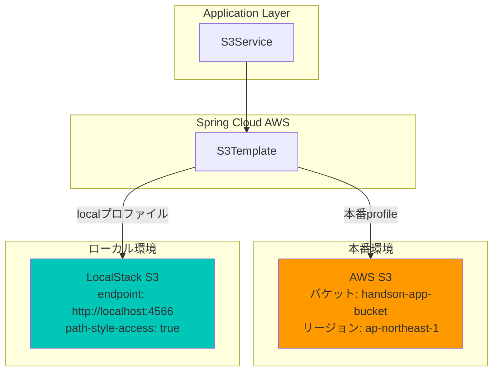

#### S3パス設計

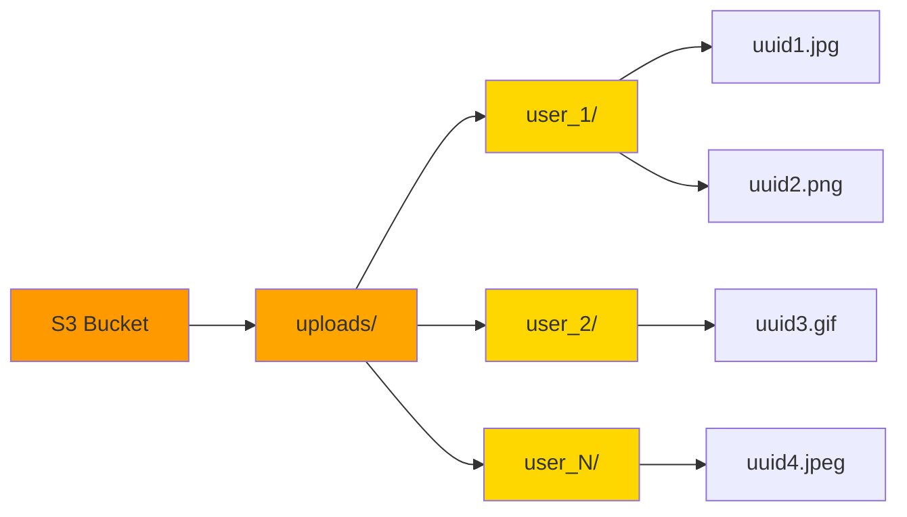

#### 5.1 AWS S3統合
- **ライブラリ**: Spring Cloud AWS 3.4.0
- **主要機能**:
  - 画像アップロード（S3Template使用）
  - 画像ダウンロード（ストリーミング）
  - 画像削除
  - Content-Type自動判定
  - エラーハンドリング（StorageException）

#### 5.2 環境対応
- **本番環境**: AWS S3（`application.yml`）
- **ローカル環境**: LocalStack（`application-local.yml`）
  - Path-style URL対応
  - テストアクセスキー使用

---

### 6. 監視・運用機能

#### ヘルスチェック構成

```mermaid
graph TB
    subgraph "外部監視システム"
        LB[ロードバランサー]
        K8S[Kubernetes/ECS]
        Monitor[監視システム]
    end

    subgraph "Spring Boot Actuator"
        Health[/actuator/health]
        Info[/actuator/info]
    end

    subgraph "ヘルスインジケーター"
        DB[Database Health]
        Disk[Disk Space Health]
        Custom[Custom Indicators]
    end

    LB -.->|ヘルスチェック| Health
    K8S -.->|Liveness/Readiness| Health
    Monitor -.->|監視| Health
    Monitor -.->|メトリクス取得| Info

    Health --> DB
    Health --> Disk
    Health --> Custom

    style Health fill:#4CAF50
    style Info fill:#2196F3
```

#### 6.1 ヘルスチェック
- **フレームワーク**: Spring Boot Actuator
- **エンドポイント**:
  - `/actuator/health` - ヘルスステータス
    - 未認証: ステータスのみ（UP/DOWN）
    - 認証済み: 詳細情報（DB接続、ディスク容量等）
  - `/actuator/info` - アプリケーション情報
- **用途**:
  - コンテナオーケストレーション（Docker, ECS, Kubernetes）
  - ロードバランサーのヘルスチェック
  - 監視システム連携

#### 6.2 ログ機能
- **フレームワーク**: SLF4J + Logback
- **ログレベル**:
  - `INFO`: 成功した操作（ユーザー登録、メモ作成、S3操作）
  - `ERROR`: 失敗（バリデーションエラー、S3エラー）
  - `WARN`: セキュリティイベント（不正アクセス試行）

---

### 7. UI/UX機能

#### テンプレート構成

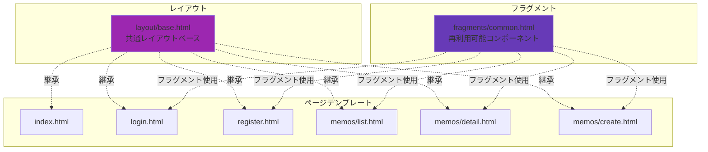

#### 7.1 テンプレート構成
- **エンジン**: Thymeleaf
- **デザインシステム**: Material Icons + カスタムCSS
- **再利用可能コンポーネント**:
  - アラートメッセージ（成功/エラー/情報）
  - アイコン付きページタイトル
  - アイコン付きボタン
  - レイアウトベーステンプレート

#### 7.2 ユーザーフィードバック
- フラッシュメッセージ（成功/エラー状態）
- インラインバリデーションエラー表示
- 確認ダイアログ（削除時）
- レスポンシブデザイン
- ホバーエフェクト

---

### 8. 開発・テスト機能

#### Docker Compose構成

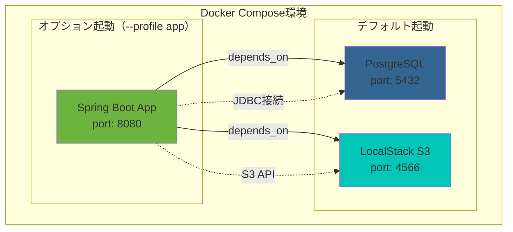

#### テスト戦略

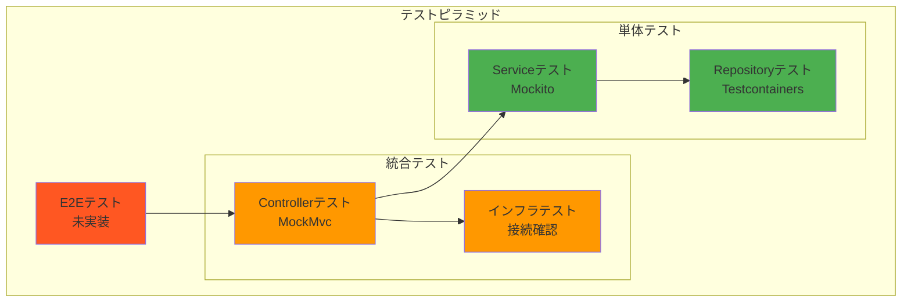

#### 8.1 ローカル開発環境
- **Docker Compose構成**:
  - PostgreSQLコンテナ
  - LocalStackコンテナ（AWS S3エミュレーション）
  - オプション: アプリケーションコンテナ
- **Makefileコマンド**:
  - `make setup`: 環境構築から起動まで一括実行
  - `make start`: インフラのみ起動
  - `make start-all`: 全サービス起動
  - `make stop`: 停止
  - `make clean`: 環境完全リセット
  - `make test`: テスト実行

#### 8.2 テスト戦略
- **TDDアプローチ**: テスト駆動開発
- **テスト種類**:
  1. **リポジトリテスト** (Testcontainers)
     - 実PostgreSQLデータベース使用
     - CRUD操作検証
     - N+1クエリ検証
  2. **サービステスト** (Mockito)
     - ビジネスロジック検証
     - S3連携（モック）
     - トランザクション動作
  3. **コントローラーテスト** (MockMvc)
     - HTTPエンドポイントテスト
     - 認証/認可
     - エラーハンドリング
  4. **インフラテスト**
     - データベース接続確認
     - S3接続確認（LocalStack）

#### 8.3 コンテナ化機能

**Dockerマルチステージビルド**:

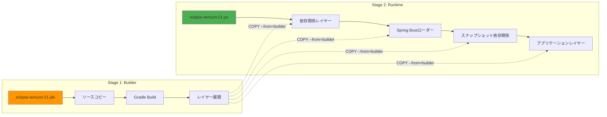

- **Dockerfile特徴**:
  - マルチステージビルド（builder + runtime）
  - レイヤードJARパターン（高速リビルド）
  - 非rootユーザーで実行（セキュリティ）
  - JREのみのランタイム（軽量化）
  - コンテナ最適化JVM設定
- **イメージサイズ**: 約572MB

---

## デプロイメントアーキテクチャ（想定）

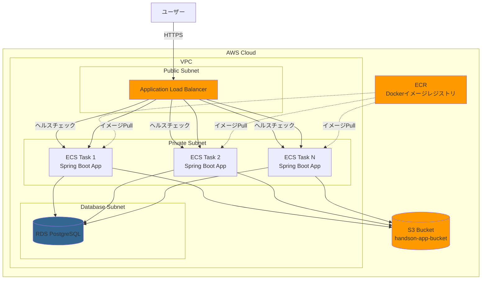

---

## セキュリティ設計原則

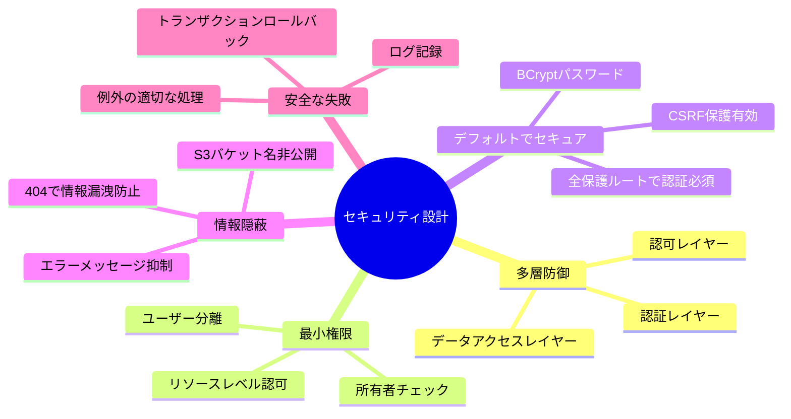

- **多層防御**: 複数の認可チェックポイント
- **最小権限**: ユーザーは自分のデータのみアクセス可能
- **デフォルトでセキュア**: すべての保護ルートで認証必須
- **情報隠蔽**: S3インフラ情報を外部に露出しない
- **安全な失敗**: 404を返す（403ではなく）、スタックトレースを隠蔽

---

## 技術スタック

| カテゴリ | 技術 |
|---------|------|
| 言語 | Java 25 |
| フレームワーク | Spring Boot 3.5.7 |
| ビルドツール | Gradle (Kotlin DSL) |
| データベース | PostgreSQL 17 |
| ORM | Spring Data JPA / Hibernate |
| セキュリティ | Spring Security |
| テンプレート | Thymeleaf |
| クラウド | Spring Cloud AWS 3.4.0 |
| マイグレーション | Flyway |
| テスト | JUnit 5, Testcontainers, MockMvc |
| コンテナ | Docker, Docker Compose |
| 監視 | Spring Boot Actuator |

---

## 今後の拡張可能性

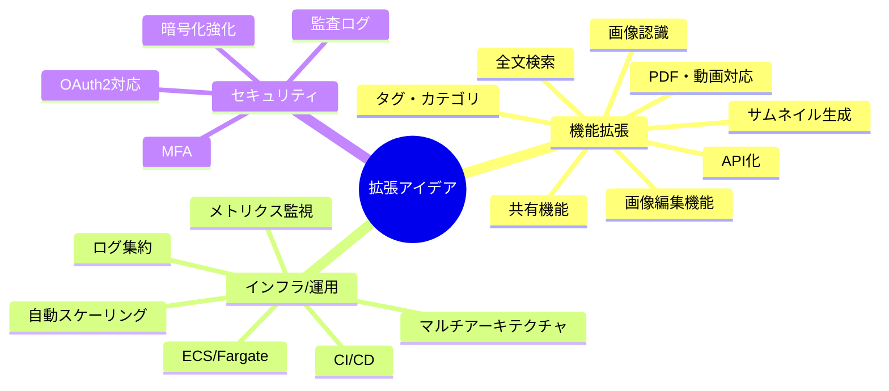

---

この概要書は、Handson Applicationの全機能をMermaid図と共に網羅しています。実装の詳細については、`CLAUDE.md`を参照してください。
